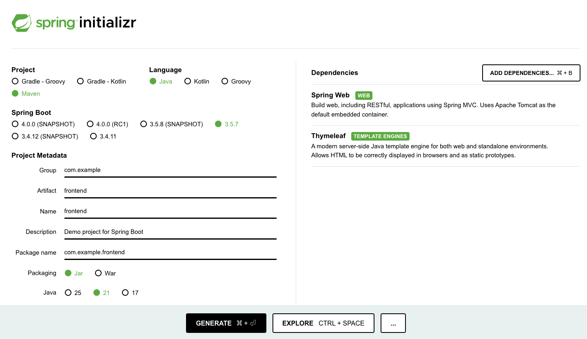

# 2. Spring Boot (Java) アプリの作成

シンプルなフロントエンドアプリを作ります。

> 💡 **このアプリは後でバックエンド API と連携させます！**

---

## 作業ディレクトリの準備

まず、ワークショップ用の作業ディレクトリを作成します:

```bash
mkdir -p ~/workshop
cd ~/workshop
```

**PowerShell の場合:**
```powershell
New-Item -Path ~/workshop -ItemType Directory -Force
cd ~/workshop
```

> 💡 以降の作業は、すべて `~/workshop` ディレクトリ内で行います。
> 
> **既に `workshop` フォルダが存在する場合**: `~/aca-workshop` や `~/container-apps-workshop` など、別の名前を使用してください。その場合、以降のコマンドのパスもそれに合わせて読み替えてください（例: `cd ~/aca-workshop/frontend`）。

---

## Spring Initializr でプロジェクト作成

ブラウザで https://start.spring.io/ を開きます。

### 設定

- **Project**: Maven
- **Language**: Java
- **Spring Boot**: 3.5.7
- **Java**: 21
- **Artifact**: `frontend`
- **Dependencies**: 以下を追加
  - Spring Web
  - Thymeleaf

「GENERATE」をクリックして、`frontend.zip` をダウンロードして作業フォルダ(workshop)に保存



### 展開

```bash
# workshop ディレクトリ内に展開
unzip frontend.zip
cd frontend
```

**PowerShell の場合:**
```powershell
# workshop ディレクトリ内に展開
Expand-Archive -Path frontend.zip -DestinationPath .
cd frontend
```

> 💡 プロジェクト構造: `~/workshop/frontend/`

---

## フロントエンドページを作成
---

### コントローラーを作成

VS Code で `src/main/java/com/example/frontend/HomeController.java` ファイルを以下のコードで新たに作成します:

> 💡 VS Code のターミナルでコマンド `code <ファイル>` を実行して簡単にオープンできます。</BR>例: `code src/main/java/com/example/frontend/HomeController.java`

```java
package com.example.frontend;

import org.springframework.stereotype.Controller;
import org.springframework.ui.Model;
import org.springframework.web.bind.annotation.GetMapping;

@Controller
public class HomeController {
    
    @GetMapping("/")
    public String home(Model model) {
        model.addAttribute("message", "フロントエンドアプリへようこそ!");
        return "index";
    }
}
```

---

## HTML テンプレートを作成

VS Code で `src/main/resources/templates/index.html` ファイルを以下のコードを利用して新たに作成します:

```html
<!DOCTYPE html>
<html xmlns:th="http://www.thymeleaf.org">
<head>
    <meta charset="UTF-8">
    <title>商品管理アプリ</title>
    <style>
        body {
            font-family: Arial, sans-serif;
            max-width: 800px;
            margin: 50px auto;
            padding: 20px;
        }
        h1 {
            color: #0078d4;
        }
        .message {
            padding: 20px;
            background-color: #f0f0f0;
            border-radius: 5px;
            margin: 20px 0;
        }
    </style>
</head>
<body>
    <h1>商品管理アプリ</h1>
    <div class="message">
        <p th:text="${message}">メッセージ</p>
    </div>
    <p>※ 後でバックエンド API と連携させます！</p>
</body>
</html>
```

---

## 設定ファイル

VS Code で `src/main/resources/application.properties` を開き、以下の設定を追加します:

```properties
server.port=8080
```

---

## アプリを起動

```bash
# ビルドして起動
./mvnw spring-boot:run
```
> `./mvnw: Permission denied` と表示された場合は `chmod a+x ./mvnw` を実行してください

```bash
# Windows の場合
mvnw.cmd spring-boot:run
```

---

## 動作確認

ブラウザで http://localhost:8080/ を開きます。

「フロントエンドアプリへようこそ!」と表示されれば成功!

---

## 完了!

✅ フロントエンドアプリが動きました!

> 💡 **このアプリは後で (セクション 7 で) バックエンド API を呼び出すように改良します！**

👉 次は [3. コンテナー化](./03-containerize.md) へ
